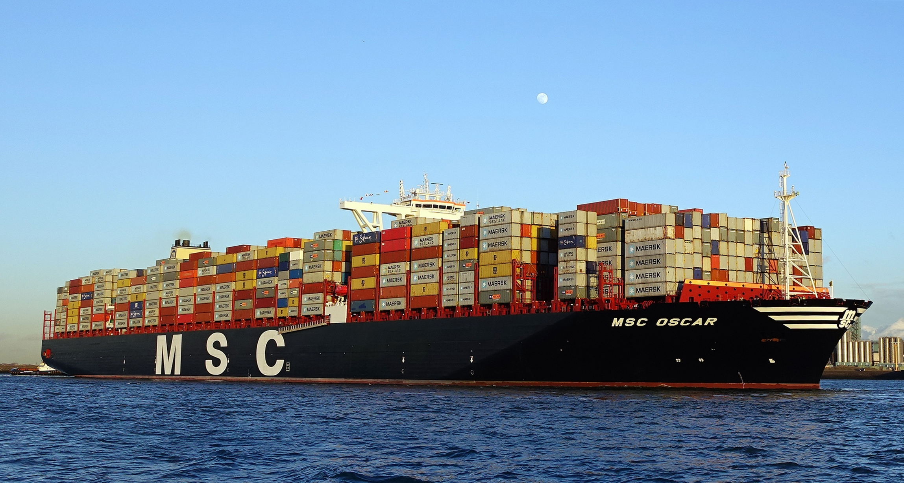

## Portfolio

---

### Data Science Projects

---

### Fruit Import & Life Expectancy Analysis

[View Project](projects/Fruit-Import-Analysis.html)

**Summary:**  
Examines the relationship between national fruit import levels and life expectancy using cross-country World Bank data.

---

---

### Chicago Spatial Analysis (Fuel Stations & Schools)

[View Project](projects/chicago-gis/prepare_maps.html)

**Summary:**  
GIS-based analysis of fuel station placement in Chicago using spatial buffers and proximity to schools to identify high-risk zones

**Methods:**
- Spatial analysis using `sf`
- Buffer creation (proximity zones)
- GIS visualization with ggplot2
- Overlay of infrastructure layers

---

Page template forked from <a href="https://github.com/evanca/quick-portfolio">evanca</a>

<!-- Remove above link if you don't want to attibute -->
